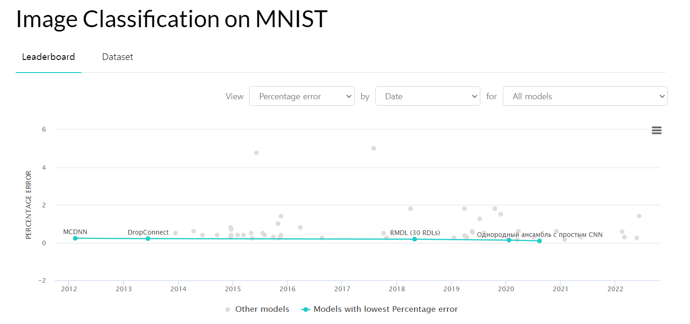
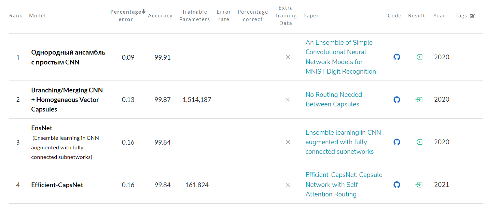
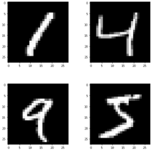
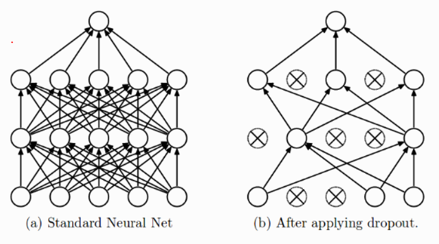
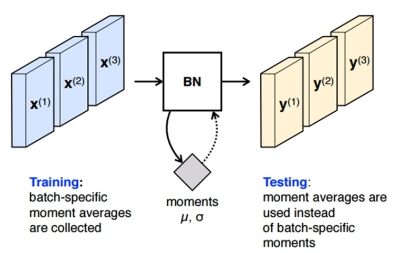
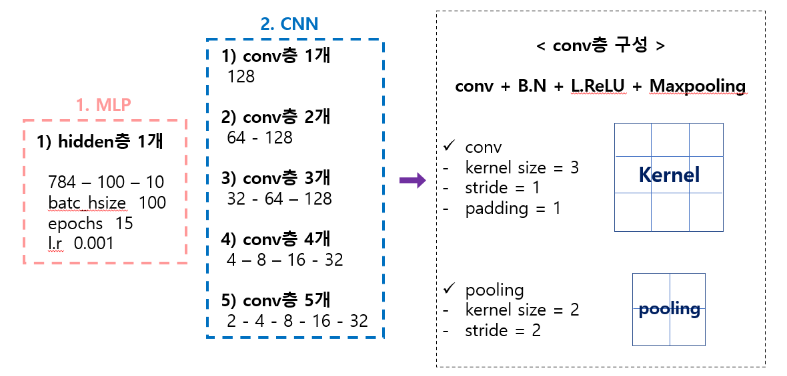

# CNN을 활용한 MNIST 데이터 인식률 개선 프로젝트

## 개요
### 목적

MNIST Leaderboard

---

- 기존 CNN 모델을 개선하여 위 리더보드상에서 순위권에 도달하도록 함을 프로젝트의 목표로 한다.

---
---

## 사용 데이터, 모델
### MNIST 데이터베이스
- 인간의 손으로 작성된 숫자로 이루어진 데형 데이터베이스.
- 화상 처리 시스템 또는 기계 학습 분야의 트레이닝 및 테스트에 널리 사용된다. 

 
 

MNIST data 

### CNN(Convolutional neural network, 합성곱 신경망)

- 다른 신경망과 마찬가지로 입력 계층, 출력 계층, 은닉 계층으로 구성.

- **컨벌루션 계층**을 통해 입력 데이터는 해당 필터를 통과, 필터에서는 입력 데이터의 특정 특징을 활성화
- **활성화 계층**에서 필터링 데이터를 활성화하며, 기울기 소실(Vanishing gradient)를 방지하기 위해 **ReLU** 활성화 함수를 사용한다.
- **풀링 계층**에서 비선형 다운 샘플링을 통한 학습 파라미터의 개수를 줄임으로 출력을 단순화 한다.

---
## 개선 과정
### 적용 기법
#### 데이터 증식(Data Augmentation)
- 기존에 60,000개의 데이터를 Resize, Crop, Rotation 등의 선형변환을 통해 데이터를 증식한다.
- 60,000개의 데이터를 추가로 증식하였으며, 총 120,000개의 데이터를 통해 CNN 모델을 학습하도록 한다.

#### 활성화 함수 및 손실 함수
##### 활성화 함수
- ReLU(Rectufied Linear Unit), Leaky ReLU 두개의 활성화 함수를 계층마다 적절히 배치하였다.
- Cross Entropy Loss(교차 엔트로시 손실) 함수를 손실함수로 적용하였다.

#### 최적화 방법
- SGD(Stochastic Gradient Descent), Add Momentum, Adaptive Gradient 등의 최적화 방법 중, 가장 인식률 개선 효과를 보인 **Adaptive Momentum** 를 최적화 방법으로 적용하였다.

#### 규제

##### Drop out

- Fully Conneted Layer(전결합 계층)에서 과대적합을 방지하기 위해 연결망 간의 뉴련을 랜덤으로 제거한다.

##### Batch Normalization(배치 정규화)

- 신경망 학습시 Gradient 기반의 학습 과정을 전체적으로 **안정화**하여 학습 속도를 가속화 한다.

##### Early Stopping

- 학습 곡선의 최적 값을 기억하고, Epoch가 반복될때마다 비교를 하여 최대의 효과(loss 와 accuarcy)로 모델을 개선한다.

#### 모델 구조

## 결과
#### 모델 별 성능 비교

| **모델**                   | **정확도** |
| -------------------------- | ---------- |
| MLP                        | 98.45      |
| CNN  (1 of conv layer)     | 98.70      |
| CNN  (2 of conv layer)     | 99.10      |
| **CNN  (3 of conv layer**) | **99.45**  |
| CNN  (4 of conv layer)     | 98.40      |
| CNN  (5 of conv layer)     | Error  !   |

- 위의 기법들을 적용후, layer의 개수를 다르게 설명한 모델 중, CNN(3 of conv layer) 모델이 가장 좋은 인식률을 보였다.
- 이는 MNIST leaderboard에서 23 ~ 24위 모형에 준하는 성능(2020년 기준)을 보인다.

##### 참고 문헌

- ImageNet Classification with Deep Convolutional Neural Networks, Alex Krizhevsky

- Adam optimization

- Wager, S., Wang, S. and Liang, P.S., 2013. Dropout training as adaptive regularization. In Advances in neural information processing systems

- https://gruuuuu.github.io/machine-learning/cnn-doc/#https://excelsior-cjh.tistory.com/180

- https://paperswithcode.com/sota/image-classification-on-mnist

- https://3months.tistory.com/118

- https://ko.wikipedia.org/wiki/MNIST_%EB%8D%B0%EC%9D%B4%ED%84%B0%EB%B2%A0%EC%9D%B4%EC%8A%A4

- https://m.blog.naver.com/msnayana/220776380373

- https://paperswithcode.com/paper/a-branching-and-merging-convolutional-network

- Machine learning(기계학습), 오일석

- Deep Learning for computer vision with python, Dr.Adrian Rosebrock

